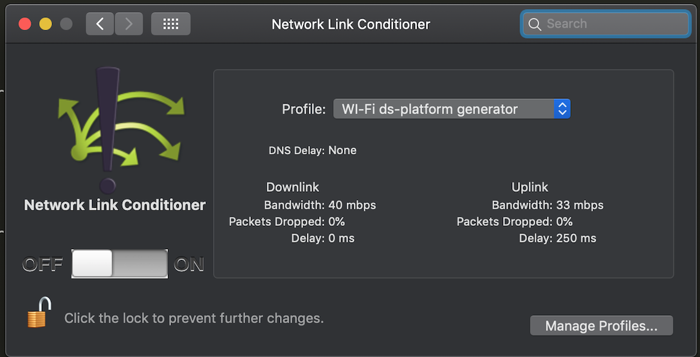
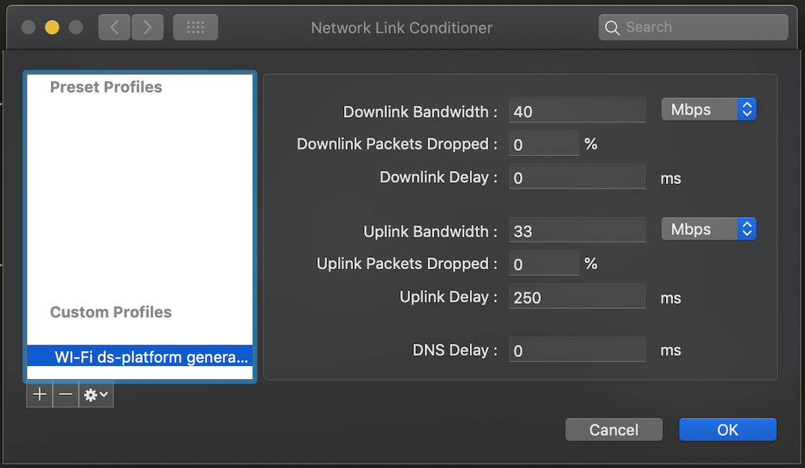
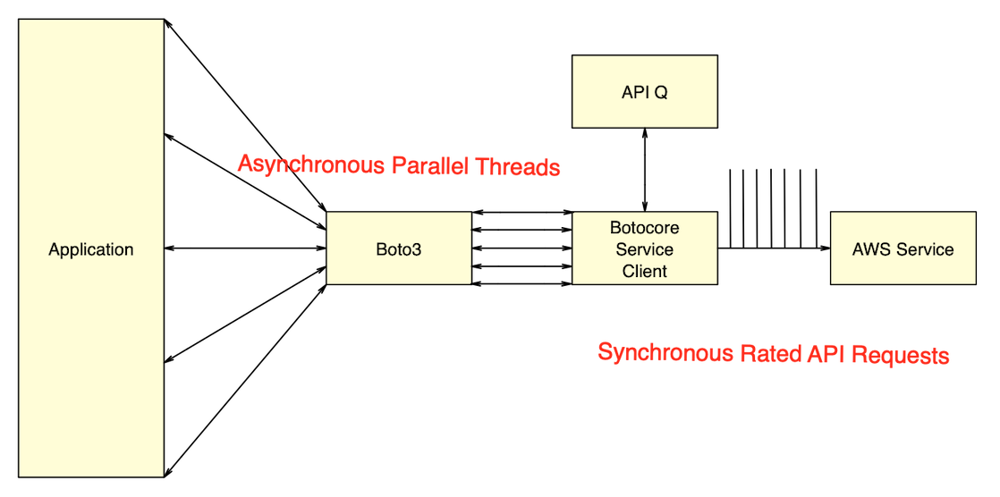
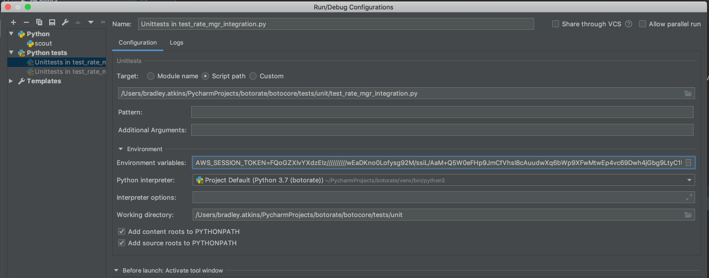

# botorate
Parent project to wrap changes to boto3, botocore and ScoutSuite to 
handle AWS rate limiting.

---

## Introduction

This project was created to address a specific issue – API rate limiting
– when scanning an AWS platform using the ScoutSuite platform scanner by
NCCGroup.

The problem with AWS applying rate limiting to the services is that it 
is indiscriminate in nature. So if you are running a multi-threaded 
scanner such as ScoutSuite, while for example an Auto Scaling Group is 
trying to scale something, the auto Scaling can fail because AWS does 
not distinguish between the third party scanner and its own services.

This is a cause for frustration amongst the platform support team and 
can also cause an outage, particularly in the early stages of 
development of a new service, where resilience and high availability are
still but a twinkle in the architect's eye...

This is becoming more and more of an issue as consumers realise the 
necessity of scanning their cloud platforms.

---

## History

I started looking into this issue when scanning my own client's platform
 and hit this when scanning some 15k of snapshots.
 
Initially I managed to mitigate this using the Network Link Conditioner 
on the MAC I was using to run the scanner. 

The NLC allows you to add latency to all outbound packets on a given 
network like so:





This blanket approach to delaying all outbound packets did resolve the 
issue of the rate limiting, but at a cost of causing the scanner to now
run for two hours in order to complete a scan of all of our development 
environments.

Not only was this slow, but it's also not OS agnostic, so hardly a good 
solution.

It occurred to me that if a mechanism could be created within boto3 
itself to queue outbound API calls at a configurable rate, then this 
might might prove to be a more general solution to the issue.



This project has the queue implemented in it and boto3 has been 
refactored to pass through the value of the API rate in ms to botocore. 
ScoutSuite is included and has simply been hardcoded to apply the queue 
to ec2 clients.

This has enabled me to conduct comparative runs between this solution 
and using the Network Link Conditioner. With the former completing in 30
 minutes and the latter in around 2 hours.
 
The queue was only applied to ec2 clients because I was only 
experiencing rate limiting on the scanning of the snapshots, around 15k 
+

However, if the eventual PR is accepted by boto3 and botocore, 
ScoutSuite could easily be modified to pass through a dictionary of 
service clients and their desired rates.

### The future

Also, if adopted, then going forward AWS might be persuaded to publish 
a limits endpoint that allows boto3 and botocore to dynamically 
discover the user's limits and configure the queue appropriately without
 human intervention...

---

# This Project

This project wraps forks of three open source projects:

* [boto3](https://github.com/boto/boto3)
* [botocore](https://github.com/boto/botocore)
* [ScoutSuite](https://github.com/nccgroup/ScoutSuite/tree/develop)

ScoutSuite is included purely to test the efficacy of the API queue 
while under development.

If the PR for boto3 and botocore is accepted then they will need to 
coordinate their releases of the new feature.

At a high level, boto3 is simply passing through an optional parameter 
for the latency desired to botocore. Botocore then uses that parameter 
when creating a service client.

---

## Project Control

A make file is provided for managing the build and installation of the 
three sub-projects that make up this feature. You can list them by 
issuing the command `make tasks` like so:
```
make tasks
	---------------------------------------
	Manage API rate manager dependent projects:
	---------------------------------------
	init: Initialise the development environment:
		Update pip and install ScoutSuite dependencies.
		Local installation of boto3 and botocore.
	install: Install the boto components locally.
	tasks: Display this list of tasks.
	test: Run the unit tests. Expects valid AWS creds in your environment variables.
	update_root:	Update the snapshot in the root project (botorate).
		Be sure to have committed each sub repo first...
	---------------------------------------
```

### Local Installation

#### Prerequisites

* python3 -m venv venv
* . venv/bin/activate

When developing you need to run the code using locally installed 
versions of the sub-projects. The supplied makefile supports installing 
the boto components: boto3 and botocore and all of the dependencies for
ScoutSuite.

On first installation run `make init`

Keep in mind that when developing you need to work in each repo, while 
when you are debugging, you are stepping through the locally installed 
packages instead.

### Pycharm Configuration

Pycharm needs to have the ScoutSuite directory marked as a 
"sources root" for local running and debugging.

#### Run config for unit tests



#### Run config for ScoutSuite


